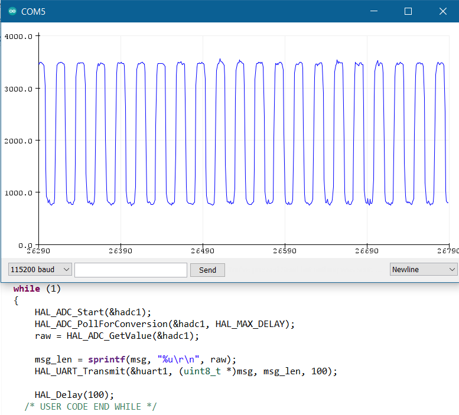
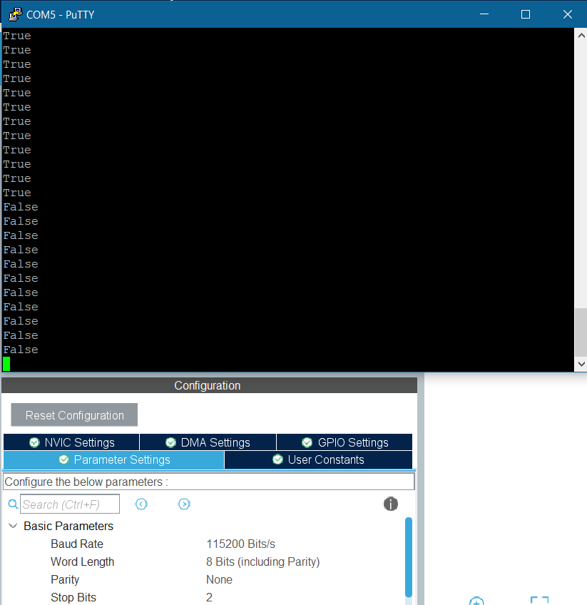

# GPIO Modes/Functions on STM32F103

## Introduction
Experimenting with the plethora of GPIO modes and functionalities which are available on STM32F103C8T6.

## Contents
```
|_ adc_cpu_poll
|_ digital_input
|_ pin_interrupts
```
1. [ADC Poll for Conversion Mode](./adc_cpu_poll/): In this project, a GPIO is used as analog input to the ADC. `HAL_ADC_PollForConversion` is used to obtain the ADC reading. Here the CPU waits for the sampling and conversion process inside the microcontroller ADC unit. This is the simplest implementation useful for infrequent ADC readings. 


<br>*[Output is shown on Arduino's Serial Plotter via UART1 of STM32 through FTDI breakout]* 

2. [GPIO as Digital Input](./digital_input/): This is a very basic functionality of GPIO, digital input.


<br>*[PuTTY serial shows the logic at the GPIO input]*

3. [External Interrupt through GPIO](./pin_interrupts/): A falling edge interrupt was configured, which when triggered, toggles a boolean flag, which enables or disables the blinking of an LED on another GPIO.


<br>*[Working shown in GIF]*